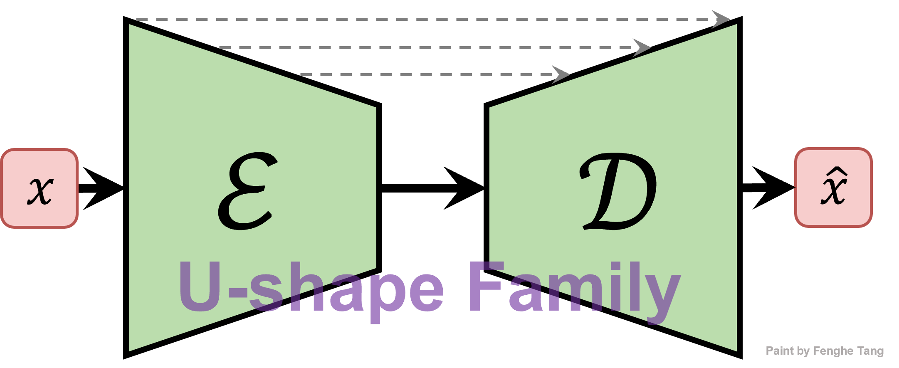

# Medical 2D Image Segmentation Benchmarks



For easy evaluation and fair comparison on 2D medical image segmentation method, we aim to collect and build a medical image segmentation U-shape architecture benchmark to implement the medical 2d image segmentation tasks.

##### News 🥰


- Mobile U-ViT is now on this repo ! 😘
- CMUNeXt is now on this repo ! 😘

This repositories has collected and re-implemented medical image segmentation networks based on U-shape architecture are followed:

|     Network     |                        Original code                         |                          Reference                           |
| :-------------: | :----------------------------------------------------------: | :----------------------------------------------------------: |
|      U-Net      | [Caffe](http://lmb.informatik.uni-freiburg.de/people/ronneber/u-net) |      [MICCAI'15](https://arxiv.org/pdf/1505.04597.pdf)       |
| Attention U-Net | [Pytorch](https://github.com/ozan-oktay/Attention-Gated-Networks) |       [Arxiv'18](https://arxiv.org/pdf/1804.03999.pdf)       |
|     U-Net++     |    [Pytorch](https://github.com/MrGiovanni/UNetPlusPlus)     | [MICCAI'18](https://www.ncbi.nlm.nih.gov/pmc/articles/PMC7329239/pdf/nihms-1600717.pdf) |
|    U-Net 3+     |    [Pytorch](https://github.com/ZJUGiveLab/UNet-Version)     |        [ICASSP'20](https://arxiv.org/pdf/2004.08790)         |
|    TransUnet    |      [Pytorch](https://github.com/Beckschen/TransUNet)       |       [Arxiv'21](https://arxiv.org/pdf/2102.04306.pdf)       |
|      MedT       | [Pytorch](https://github.com/jeya-maria-jose/Medical-Transformer) |      [MICCAI'21](https://arxiv.org/pdf/2102.10662.pdf)       |
|      UNeXt      | [Pytorch](https://github.com/jeya-maria-jose/UNeXt-pytorch)  |      [MICCAI'22](https://arxiv.org/pdf/2203.04967.pdf)       |
|    SwinUnet     |    [Pytorch](https://github.com/HuCaoFighting/Swin-Unet)     |       [ECCV'22](https://arxiv.org/pdf/2105.05537.pdf)        |
|     CMU-Net     |       [Pytorch](https://github.com/FengheTan9/CMU-Net)       |       [ISBI'23](https://arxiv.org/pdf/2210.13012.pdf)        |
|     CMUNeXt     |       [Pytorch](https://github.com/FengheTan9/CMUNeXt)       |       [ISBI'24](https://arxiv.org/pdf/2308.01239.pdf)       |
|     MK-UNet     |       [Pytorch](https://github.com/SLDGroup/MK-UNet)         |       [ICCVW'25](https://openaccess.thecvf.com/content/ICCV2025W/CVAMD/papers/Rahman_MK-UNet_Multi-kernel_Lightweight_CNN_for_Medical_Image_Segmentation_ICCVW_2025_paper.pdf) |
|  Mobile U-ViT   |       [Pytorch](https://github.com/FengheTan9/Mobile-U-ViT)  |       [ACM MM'25](https://arxiv.org/pdf/2508.01064.pdf)       |
## Datasets

Please put the [BUSI](https://www.kaggle.com/aryashah2k/breast-ultrasound-images-dataset) dataset or your own dataset as the following architecture. 

```
├── Medical-Image-Segmentation-Benchmarks
    ├── data
        ├── busi
            ├── images
            |   ├── benign (10).png
            │   ├── malignant (17).png
            │   ├── ...
            |
            └── masks
                ├── 0
                |   ├── benign (10).png
                |   ├── malignant (17).png
                |   ├── ...
        ├── your 2D dataset
            ├── images
            |   ├── 0a7e06.png
            │   ├── 0aab0a.png
            │   ├── 0b1761.png
            │   ├── ...
            |
            └── masks
                ├── 0
                |   ├── 0a7e06.png
                |   ├── 0aab0a.png
                |   ├── 0b1761.png
                |   ├── ...
    ├── src
    ├── main.py
    ├── split.py
```

## Environments

- GPU: NVIDIA GeForce RTX4090 GPU
- Pytorch: 1.13.0 cuda 11.7
- cudatoolkit: 11.7.1
- scikit-learn: 1.0.2
- albumentations: 1.2.0

## Training

You can first split your dataset:

```python
python split.py --dataset_root ./data --dataset_name busi
```

Then, training and validating your dataset:

```python
python main.py --model [MobileUViT/CMUNeXt/CMUNet/MK_UNet/TransUnet/...] --base_dir ./data/busi --train_file_dir busi_train.txt --val_file_dir busi_val.txt --base_lr 0.01 --epoch 300 --batch_size 8
```

### Extra augmentation profiles

`--use_extra_aug` keeps the existing `legacy` augmentation profile by default. For HSPM experiments, `hspm_safe` protects lesion geometry by using only mild image-style perturbations and requires `--use_extra_aug`:

```bash
python main.py --model CMUNeXt_HSPM \
  --base_dir ./data/busi --train_file_dir busi_train3.txt --val_file_dir busi_val3.txt \
  --save_dir ./checkpoint/6.13/busi-CMUNeXt_HSPM-dual-global-coarse01-hspm-safe-3-a \
  --base_lr 0.01 --epoch 300 --batch_size 8 \
  --hspm_backbone_mode dual_path \
  --hspm_fusion_mode global \
  --hspm_mixer_mode legacy \
  --hspm_coarse_loss_weight 0.1 \
  --use_extra_aug --extra_aug_profile hspm_safe
```

HSPM channel widths can be changed without editing the model code. The default
`--hspm_dims 16,32,128,160,256` preserves existing checkpoints. A lightweight
dual-path configuration uses about 1.59M parameters:

```bash
python main.py --model CMUNeXt_HSPM \
  --base_dir ./data/busi --train_file_dir busi_train3.txt --val_file_dir busi_val3.txt \
  --save_dir ./checkpoint/busi-CMUNeXt_HSPM-light-dual-3-a \
  --base_lr 0.01 --epoch 300 --batch_size 8 \
  --hspm_backbone_mode dual_path \
  --hspm_dims 16,32,64,128,160
```

Use the same `--hspm_dims` value with `infer.py` when loading the resulting
checkpoint.

### US-LGSF skip fusion

`CMUNeXt_USLGSF` replaces selected CMUNeXt skip connections with ultrasound
local-structure guided skip fusion. The default configuration refines only the
two shallowest skips, combines multi-scale structural reliability with decoder
semantic relevance, and keeps the original `BCEDiceLoss`:

```bash
python main.py --model CMUNeXt_USLGSF \
  --base_dir ./data/busi --train_file_dir busi_train3.txt --val_file_dir busi_val3.txt \
  --save_dir ./checkpoint/busi-CMUNeXt_USLGSF-full-3-a \
  --base_lr 0.01 --epoch 300 --batch_size 8 \
  --uslgsf_stages 0,1 \
  --uslgsf_smooth_kernels 3,7 \
  --uslgsf_context_downsample 2 \
  --uslgsf_alpha_init 0.05 --uslgsf_alpha_max 0.5 \
  --uslgsf_mode full
```

Use `--uslgsf_mode context_only`, `structure_only`, or `relevance_only` for
core ablations. Stage ablations can be run with `--uslgsf_stages 0` or
`--uslgsf_stages 0,1,2`.

### Identity-safe US-LGSF V2

`CMUNeXt_USLGSF_V2` keeps the original US-LGSF model and checkpoints intact,
but changes skip refinement to an identity-safe, uncertainty-routed residual.
The decoder relevance map supplies a detached uncertainty gate, and stage 0
always keeps full-resolution context while deeper stages use
`--uslgsf_context_downsample`:

```bash
python main.py --model CMUNeXt_USLGSF_V2 \
  --base_dir ./data/busi --train_file_dir busi_train3.txt --val_file_dir busi_val3.txt \
  --save_dir ./checkpoint/busi-CMUNeXt_USLGSF_V2-full-3-a \
  --base_lr 0.01 --epoch 300 --batch_size 8 \
  --uslgsf_stages 0,1 \
  --uslgsf_smooth_kernels 3,7 \
  --uslgsf_context_downsample 2 \
  --uslgsf_alpha_init 0.05 --uslgsf_alpha_max 0.5 \
  --uslgsf_mode full
```

Validate a V2 checkpoint with the same US-LGSF options:

```bash
python infer.py --model CMUNeXt_USLGSF_V2 \
  --model_path ./checkpoint/busi-CMUNeXt_USLGSF_V2-full-3-a/CMUNeXt_USLGSF_V2_model.pth \
  --base_dir ./data/busi --train_file_dir busi_train3.txt --val_file_dir busi_val3.txt \
  --uslgsf_stages 0,1 --uslgsf_context_downsample 2
```

V1 checkpoints are not migrated to V2; train V2 from a fresh initialization.

### Dynamic structure-relevance US-LGSF V3

`CMUNeXt_USLGSF_V3` dynamically combines multi-scale structural reliability
with encoder-decoder semantic relevance at the two shallow skip stages. A
pixel-wise softmax predicts the structure and relevance weights, and an
identity-safe bounded residual injects the selected local detail without an
auxiliary coarse head or uncertainty route:

```bash
python main.py --model CMUNeXt_USLGSF_V3 \
  --base_dir ./data/busi --train_file_dir busi_train3.txt --val_file_dir busi_val3.txt \
  --save_dir ./checkpoint/busi-CMUNeXt_USLGSF_V3-full-3-a \
  --base_lr 0.01 --epoch 300 --batch_size 8 \
  --uslgsf_stages 0,1 \
  --uslgsf_smooth_kernels 3,7 \
  --uslgsf_context_downsample 2 \
  --uslgsf_alpha_init 0.05 --uslgsf_alpha_max 0.5 \
  --uslgsf_mode full \
  --uslgsf_residual_init_scale 0.05
```

Validate a V3 checkpoint with full residual routing:

```bash
python infer.py --model CMUNeXt_USLGSF_V3 \
  --model_path ./checkpoint/busi-CMUNeXt_USLGSF_V3-full-3-a/CMUNeXt_USLGSF_V3_model.pth \
  --base_dir ./data/busi --train_file_dir busi_train3.txt --val_file_dir busi_val3.txt \
  --uslgsf_stages 0,1 --uslgsf_context_downsample 2 \
  --uslgsf_mode full --uslgsf_residual_init_scale 0.05
```

V3 supports `full`, `context_only`, `structure_only`, and `relevance_only`.
Use `model.set_uslgsf_route_scale(0)` for a strict no-injection ablation.
V3 supports only stages `0` and `1` and uses the standard `BCEDiceLoss` and
optimizer settings. It must be trained from a fresh initialization; previous
V3 checkpoints are incompatible, while V1 and V2 checkpoints remain unchanged.

For the first APBR structure-validation run, keep the strongest HSPM settings fixed,
warm up APBR routing, and disable boundary loss and coarse-loss decay:

```bash
python main.py --model CMUNeXt_HSPM_APBR \
  --base_dir ./data/busi --train_file_dir busi_train3.txt --val_file_dir busi_val3.txt \
  --save_dir ./checkpoint/6.13/busi-CMUNeXt_HSPM_APBR-full-3-a \
  --base_lr 0.01 --epoch 300 --batch_size 8 \
  --hspm_fusion_mode global --hspm_mixer_mode legacy \
  --apbr_mode full --apbr_route_warmup_epochs 30 \
  --apbr_coarse_loss_weight 0.1 --apbr_coarse_loss_final_weight 0.1 \
  --apbr_coarse_loss_decay_epochs 0 --apbr_intermediate_loss_weight 0.15 \
  --apbr_boundary_loss_weight 0 --early_stop_patience 40 \
  --use_extra_aug --extra_aug_profile hspm_safe
```

`CMUNeXt_HSPM_APBR_V2` is an independent refinement architecture. It routes from
the current-stage baseline and uses a zero-initialized unbounded logit correction
head. For a fair first comparison against
`busi-CMUNeXt_HSPM_APBR-full-coarse01-bounded-3-a`, change only the model name
and save directory:

```bash
python main.py --model CMUNeXt_HSPM_APBR_V2 \
  --base_dir ./data/busi --train_file_dir busi_train3.txt --val_file_dir busi_val3.txt \
  --save_dir ./checkpoint/6.14/busi-CMUNeXt_HSPM_APBR_V2-full-coarse01-bounded-3-a \
  --base_lr 0.01 --epoch 300 --batch_size 8 \
  --hspm_fusion_mode global \
  --hspm_mixer_mode bounded \
  --hspm_gamma_init 0.1 \
  --hspm_gamma_max 0.3 \
  --apbr_mode full \
  --apbr_route_warmup_epochs 30 \
  --apbr_coarse_loss_weight 0.1 \
  --apbr_coarse_loss_final_weight 0.1 \
  --apbr_coarse_loss_decay_epochs 0 \
  --apbr_intermediate_loss_weight 0.15 \
  --apbr_boundary_loss_weight 0
```

`CMUNeXt_HSPM_SDFR` adds signed-distance supervision and delayed, bounded
boundary refinement to the strongest dual-path HSPM baseline. SDF supervision
warms up during epochs 0-10; refinement stays disabled until epoch 10 and then
warms up through epoch 40:

```bash
python main.py --model CMUNeXt_HSPM_SDFR \
  --base_dir ./data/busi --train_file_dir busi_train3.txt --val_file_dir busi_val3.txt \
  --save_dir ./checkpoint/6.15/busi-CMUNeXt_HSPM_SDFR-full-3-a \
  --base_lr 0.01 --epoch 300 --batch_size 8 \
  --hspm_fusion_mode global --hspm_mixer_mode legacy \
  --hspm_coarse_loss_weight 0.1 --hspm_coarse_loss_final_weight 0.02 \
  --hspm_coarse_loss_decay_epochs 150 \
  --sdfr_sdf_loss_weight 0.2 --sdfr_sdf_warmup_epochs 10 \
  --sdfr_refine_start_epoch 10 --sdfr_refine_warmup_epochs 30 \
  --sdfr_truncation_ratio 0.08 --sdfr_boundary_temperature 0.2 \
  --sdfr_boundary_emphasis 4.0 \
  --sdfr_refine_scale_init 0.05 --sdfr_refine_scale_max 0.3
```

For SDF-only ablations, keep refinement disabled with
`--sdfr_refine_start_epoch 300`. Use `--sdfr_sdf_warmup_epochs 0` for fixed
SDF weighting, or `--sdfr_boundary_emphasis 0` to remove boundary weighting.

`CMUNeXt_HSPM_SDFR_V2` is the stable boundary-gated logit-correction variant.
It initializes from a trained dual-path HSPM checkpoint, freezes the HSPM base
for the full run, and isolates SDF/correction gradients from the base decoder.
The correction and boundary-band loss follow the same epoch 10-40 warmup:

```bash
python main.py --model CMUNeXt_HSPM_SDFR_V2 \
  --base_dir ./data/busi --train_file_dir busi_train3.txt --val_file_dir busi_val3.txt \
  --save_dir ./checkpoint/6.16/busi-CMUNeXt_HSPM_SDFR_V2-stable-3-a \
  --base_lr 0.01 --epoch 300 --batch_size 8 \
  --sdfr_v2_hspm_checkpoint ./checkpoint/6.14/busi-CMUNeXt_HSPM-dual-global-coarse-decay-3-a/CMUNeXt_HSPM_model.pth \
  --hspm_fusion_mode global --hspm_mixer_mode legacy \
  --sdfr_sdf_loss_weight 0.2 --sdfr_sdf_warmup_epochs 10 \
  --sdfr_refine_start_epoch 10 --sdfr_refine_warmup_epochs 30 \
  --sdfr_truncation_ratio 0.08 --sdfr_boundary_temperature 0.2 \
  --sdfr_boundary_emphasis 4.0 \
  --sdfr_v2_base_loss_weight 0 --sdfr_v2_band_width 0.2 \
  --sdfr_v2_band_loss_weight 0.1 \
  --sdfr_v2_correction_scale_init 0.1 --sdfr_v2_correction_scale_max 0.5
```

Old SDFR V2 checkpoints still load strictly. To reproduce their original
correction scaling during inference, pass
`--sdfr_v2_correction_scale_init 1.0 --sdfr_v2_correction_scale_max 3.0`.

## Inference

```python
python infer.py --model [MobileUViT/CMUNeXt/CMUNet/MK_UNet/TransUnet/...] --model_path [.pth] --base_dir ./data/busi --val_file_dir busi_val.txt --img_size 256 --num_classes 1
```


## Results on BUSI

We train the U-shape based networks with [BUSI dataset](https://www.kaggle.com/aryashah2k/breast-ultrasound-images-dataset). The BUSI collected 780 breast ultrasound images, including normal, benign and malignant cases of breast cancer with their corresponding segmentation results. **We only used benign and malignant images (647 images)**. And we randomly split thrice in [/data](https://github.com/FengheTan9/Medical-Image-Segmentation-Benchmarks/tree/main/data), 70% for training and 30% for validation. In addition, we resize all the images 256×256 and perform random rotation and flip for data augmentation.

|     Method      |   Params (M)    |        FPS        |     GFLOPs      |          IoU          |       F1-value        |
| :-------------: | :-------------: | :---------------: | :-------------: | :-------------------: | :-------------------: |
|      U-Net      |      34.52      |      139.32       |      65.52      |      68.61±2.86       |      76.97±3.10       |
| Attention U-Net |      34.87      |      129.92       |      66.63      |      68.55±3.22       |      76.88±3.50       |
|     U-Net++     |      26.90      |      125.50       |      37.62      |      69.49±2.94       |      78.06±3.25       |
|     U-Net3+     |      26.97      |       50.60       |     199.74      |      68.38±3.35       |      76.88±3.68       |
|    TransUnet    |     105.32      |      112.95       |      38.52      |      71.39±2.37       |      79.85±2.59       |
|      MedT       | **<u>1.37</u>** |       22.97       |      2.40       |      63.36±1.56       |      73.37±1.63       |
|    SwinUnet     |      27.14      |      392.21       |      5.91       |      54.11±2.29       |      65.46±1.91       |
|      UNeXt      |      1.47       | **<u>650.48</u>** | **<u>0.58</u>** |      65.04±2.71       |      74.16±2.84       |
|     CMU-Net     |      49.93      |       93.19       |      91.25      |      71.42±2.65       |      79.49±2.92       |
|     CMUNeXt     |      3.14       |      471.43       |      7.41       |      71.56±2.43       |      79.86±2.58       |
|   Mobile U-ViT  |      1.39       |      326.24       |      2.51       | **<u>72.88±2.72</u>** | **<u>81.18±3.05</u>** |

## Acknowledgements:

This code-base uses helper functions from [CMU-Net](https://github.com/FengheTan9/CMU-Net) and [Image_Segmentation](https://github.com/LeeJunHyun/Image_Segmentation).

## Other QS:

If you have any questions or suggestions about this project, please contact me through email: 543759045@qq.com
